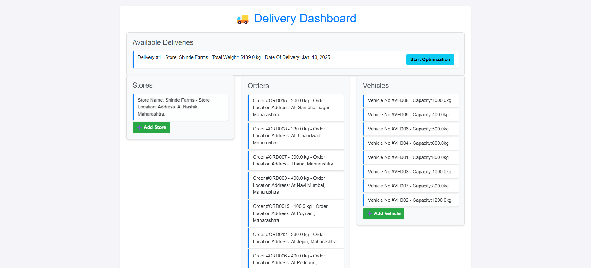
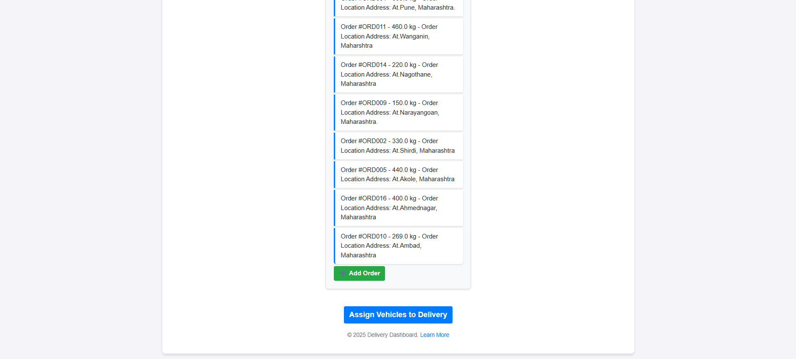
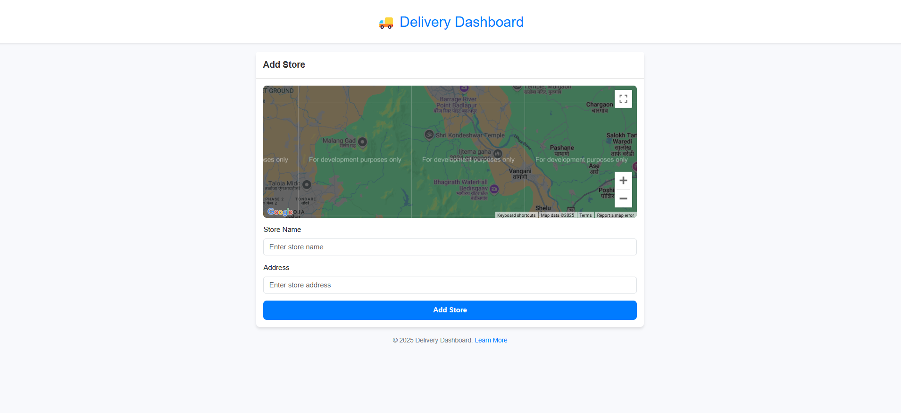
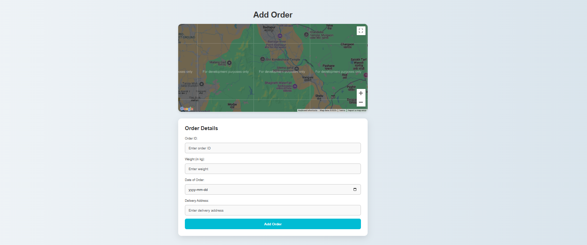
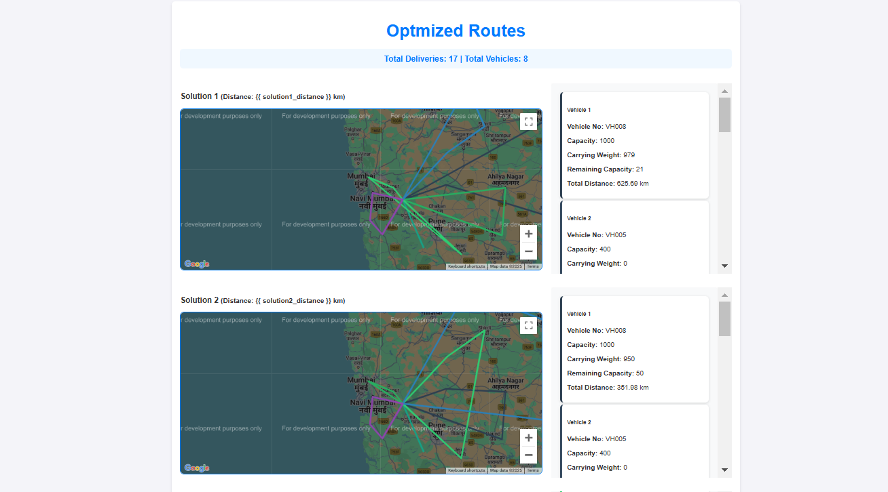
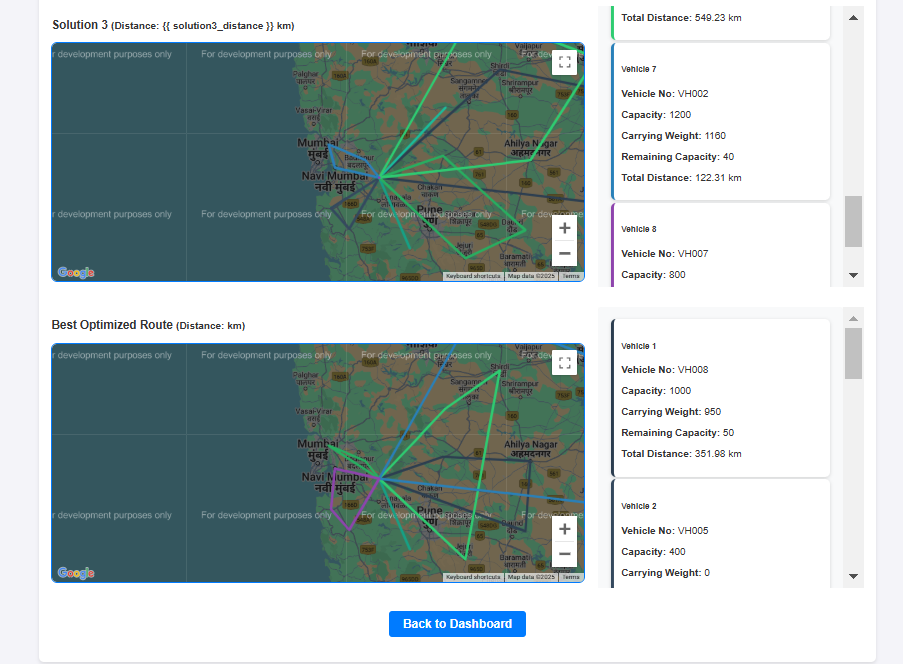

# Smart Path Delivery

# Introduction 
A system for delivering items to multiple locations by determining the shortest possible path that satisfies delivery requirements, ensures all destinations are visited, and returns to the starting point efficiently.

## Branches 
## 1. Setup_feature 
### This branch includes:
    1.All required settings for the project.
    2.Docker system configurations.
    2.The complete project structure for the Smart Path Delivery application.
    

## 2.Model_Feature  
### Models, admin configurations, and utility functions for routing algorithms.
    > Optimization Algorithm: Leverages advanced algorithms, like those in Google OR-Tools, to evaluate and calculate the optimal delivery paths based on various constraints.
    > Shortest Path Calculation: Uses the Haversine formula and tools like OR-Tools to compute the shortest and most efficient delivery routes based on geographical data.
    > Vehicle Allocation Optimization: Utilizes advanced optimization techniques (e.g., vehicle routing problem solvers in OR-Tools) to allocate vehicles in a manner that minimizes vehicle usage while ensuring all deliveries are completed efficiently, factoring in capacity and route optimization.
### Models:
 
 #### 1. Location Model
    > Stores location information for:
        1. Customer orders.
        2. Stores or hubs.
        3. Includes geographical coordinates for precise routing.

 #### 2. Order Model
    > Captures details of customer orders, such as:
        1. Order ID.
        2. Items and quantities.

 #### 3. Store Model
    > Represents a hub or warehouse where:
        1. Vehicles begin and end their delivery routes.
        2. Inventory for deliveries is stored.

 #### 4. Vehicle Model
    > Contains details about vehicles, including:
        1. Vehicle number.
        2. Weight capacity.
        3. Average speed.

 #### 5. Delivery Model
    > Tracks delivery-specific details:
        1. Assigned vehicles for the delivery.
        2. Total route distance.
        3. Total weight carried by all vehicles.

## 2.user_interface_feature 
### This branch includes:
    > Front end for visualizing the optimized data routes produced by algorithms along with vehicle information and orders placed by a customers for  getting more and clear insights of the project.
#### Home page: 
    > Serves as a dashboard providing an overview of:
    1> All available orders, vehicles, and stores.
    2> The list of currently available deliveries.
    3> Includes a detailed section for available deliveries, dynamically updating based on the algorithm's output.

#### Add Store page:
    1> Enables users to add new store locations.
    2> Each store includes critical information such as address, coordinates (using PointField), and related details for routing.

#### Add Order page:
    > Facilitates adding customer orders.

#### Add Vehicle page:
    > Allows adding vehicles with properties like Weight capacity in kg, Average speed in kmh.

#### Start Optimization Page:
    > Displays:
        1. Interactive visualizations of routes generated by the algorithm.
        2. Vehicle details with assigned routes, including:
        3. Total distance covered.
        4. Orders assigned.
        5. Remaining capacity.

    

